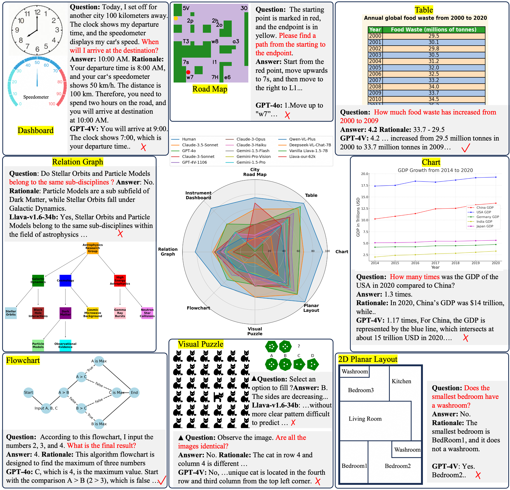

# Multi-modal Self-Instruct
[](https://arxiv.org/abs/2407.07053)
[](https://multi-modal-self-instruct.github.io)
[](https://huggingface.co/datasets/zwq2018/Multi-modal-Self-instruct)


🎆 [New 0920] **Our paper is accepted by EMNLP 2024 Main**

🎆 [New 0801] **Our paper has been noticed and reported by social media: [新智元](https://www.thepaper.cn/newsDetail_forward_28346662).**

The codebase for our paper: Multimodal Self-Instruct: Synthetic Abstract Image and Visual Reasoning Instruction Using Language Model (https://arxiv.org/abs/2407.07053)

For more details, please refer to the project page with dataset exploration and visualization tools: [https://multi-modal-self-instruct.github.io](https://multi-modal-self-instruct.github.io).


## What is Multi-modal Self-Instruct?
- We identify that current LMMs have a significant gap compared to humans in understanding and visually reasoning about **abstract images**, such as maps, charts, and layouts. 

- Utilizing LLM and code, We design a multi-modal self-instruct strategy to synthesize a diverse set of abstract images and reasoning instructions, providing value data for LMMs.

- We synthesized a benchmark of 11,193 high-quality abstract images, covering eight common scenarios: **charts**, **tables**, **simulated maps**, **dashboards**, **flowcharts**, **relation graphs**, **floor plans**, and **visual puzzles**. Our benchmark exposes the shortcomings of advanced LMMs like Claude-3.5-Sonnet and GPT-4o in abstract image understanding, spatial relations reasoning, and visual element induction.

- We also synthesized **62,476** charts, tables, and road map instructions for fine-tuning, verifying the effectiveness of the synthesized data.
  


## Leaderboard on Our Abstract Image Benchmark
| LLMs            | Chart | Table | Road Map | Dashboard | Relation Graph | Flowchart | Visual Puzzles | Layout | Avg. |
|-----------------|-------|-------|----------|-----------|----------------|-----------|----------------|--------|------|
| **Human**       | **93.5** | **95.1** | **75.0** | **85.3** | **82.5** | **65.5** | **62.5** | **97.6** | **82.1** |
| Claude-3.5-Sonnet | 67.24* | 84.38 | 59.24 | 54.00 | 58.52* | 49.21 | 62.38* | 82.94* | 64.74* |
| GPT-4o          | 61.83 | 88.76* | 37.82 | 54.79* | 54.50 | 54.31* | 45.37 | 82.54 | 59.99 |
| Claude-3-Sonnet | 46.4 | 68.4 | 38.3 | 35.4 | 56.2 | 40.3 | 47.0 | 69.1 | 50.1 |
| GPT-4V-1106     | 50.6 | 75.8 | 23.3 | 36.2 | 52.4 | 45.3 | 35.9 | 76.6 | 49.5 |
| GPT-4o-mini	    |48.7  |	77.4 |26.7 |46.3	|51.1  |	42.5|	30.8 |75.8	| 49.5|
| Claude-3-Opus   | 46.73| 67.71 | 38.26 | 38.70 | 48.78 | 35.77 | 47.26 | 65.48 | 48.59 |
| Internvl-2-8b	  |50.3  |	73.9 |27.9	 | 28.9  |	61.3 |	41.2 |	23.4 |	66.6 |	46.7|
| Claude-3-Haiku  | 41.83 | 57.33 | 23.17 | 35.83 | 45.99 | 23.09 | 45.94 | 58.73 | 41.49 |
| Gemini-1.5-Flash| 43.61 | 64.06 | 3.71 | 39.04 | 42.09 | 36.03 | 30.81 | 69.72 | 41.13 |
| glm-4v-9b     	| 47.8	|70.9  |4.4   |	  34.3 |	47.0|	39.3 |20.2|	63.8|	41.0|
| Gemini-Pro-Vision | 43.11 | 64.92 | 3.76 | 38.87 | 41.12 | 36.09 | 29.68 | 70.12 | 40.96 |
| Gemini-1.5-Pro | 43.41 | 63.78 | 3.77 | 38.71 | 41.85 | 35.55 | 30.62 | 69.32 | 40.88 |
| Qwen-VL-Plus   | 40.1 | 51.6 | 18.6 | 26.4 | 52.2 | 32.5 | 32.3 | 61.5 | 39.4 |
| Deepseek-VL-7B | 25.2 | 31.1 | 18.8 | 18.2 | 37.6 | 20.8 | 15.0 | 47.2 | 26.7 |
| Llava-1.5-7B | 10.5 | 15.8 | 0.3 | 16.5 | 29.6 | 9.6 | 3.4 | 37.7 | 15.4 |
| Llava-our-$62k$ | 30.3 | 51.8 | 67.7* | 16.5 | 30.1 | 12.3 | 3.6 | 44.1 | 32.0 |

*Bold indicates the best performance. $^{\ast}$ indicates the second highest.*


## Installation

```text
data-engine/
├── data_generator/
│ ├── algorithm
│ ├── dashboard
│ ├── iq (visual puzzles)
│ ├── flowchart
│ ├── organization (relation graph)
│ ├── utils
│ └── entry.py
├── domain_generator/
│ ├── bootstrap_domains.py
│ ├── gpt4_tools.py
│ └── filter.py
├── README.md
└── requirements.txt
```

1. Install `Graphviz` and `phantomjs` to make sure you can save images locally.
   
   - **Graphviz**: please refer to [Graphviz Download](https://graphviz.org/download/).
   - **phantomjs**: please refer to [phantomjs Download](https://phantomjs.org/download.html).

2. Install `requirements.txt`.
    ```bash
    pip install -r requirements.txt
    ```
## Abstract Image Generation
1. Domain generation.  
   Options for `type`: organization, algorithm, flowchart, dashboard.
    ```bash
    python bootstrap_domains.py --type xxx
    ```
   
2. Data and plots generation.  
   Options for `type`: organization, algorithm, flowchart, dashboard.
   ```bash
    python entry.py --type xxx
    ```

3. For visual puzzles in `data_generator/iq`, run
   ```bash
    python iq.py
    ```

## Evaluation
We present a collection of 11,193 high-quality abstract images and corresponding question-answer pairs, meticulously curated using our multi-modal self-instruct strategy (Huggingface dataset [](https://huggingface.co/datasets/zwq2018/Multi-modal-Self-instruct)). You can use these benchmarks for evaluating your own VLMs.

Additionally, we offer 62,476 training instructions, including tables, charts, and road maps. 

The following methodologies are provided for evaluating new models.


In `scripts` folder, we provide automatic evaluation pipeline to evaluate your models.

1. Run `eval_model.py` to produce evaluation result for a specificy model and a task.

   You need to fill in `engine = 'xxx'`, `task = 'xxx'` and `xxx/eval_xxxk.json` to specify the model and the task.

   In `llm_tools.py`, you need to fill in `<Your-Api Key>`, `url = "xxx"` and `engine == "xxx"`.
   
    ```bash
    python eval_model.py
    ```

2. Run `eval_vqa.py` to check the accuracy of a model on a task.

   Function `evaluator('./xxx.json')` will test the accuracy of the model on charts, tables, dashboards, flowcharts, relation graphs, floor plans, and visual puzzles(7 tasks).

   Function `evaluator_map('./xxx.json')` will test the accuracy of the model on simulated maps(1 task).
   
   ```bash
    python eval_vqa.py
    ```

## Citation
```
@article{zhang2024multimodal,
  title={Multimodal Self-Instruct: Synthetic Abstract Image and Visual Reasoning Instruction Using Language Model},
  author={Zhang, Wenqi and Cheng, Zhenglin and He, Yuanyu and Wang, Mengna and Shen, Yongliang and Tan, Zeqi and Hou, Guiyang and He, Mingqian and Ma, Yanna and Lu, Weiming and others},
  journal={arXiv preprint arXiv:2407.07053},
  year={2024}
}
```


